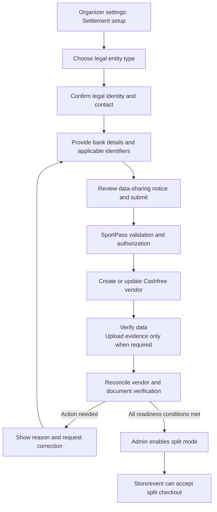

# Cashfree Split: vendor onboarding and document handling

Date: 2026-10-01. Companion to [the payment implementation plan](payment-platform-implementation-plan.md).

This is a proposed implementation guide, not an implemented onboarding flow. The verified API capabilities below are distinct from the proposed SportPass collection policy. Obtain Cashfree's entity-specific document checklist for the SportPass account before making documents mandatory. A field or document type being supported does not mean every vendor must supply it.

Product requirement: collect the fewest fields and files possible, support intake for all organizer categories, and request additional evidence only for an applicable unresolved requirement. Do not confuse broad SportPass intake support with guaranteed Cashfree approval for every legal structure.

## Minimum-document policy — revised after research

The target is **zero file uploads where Cashfree accepts verified data alone**, not a promise of zero KYC or zero uploads for every vendor. The public API references do not establish an exhaustive entity-by-entity minimum or universal acceptance of informal clubs. Treat any such claim as unverified until Cashfree confirms it for SportPass.

1. Start with legal recipient type, legal name, email, mobile and settlement-account details; reuse existing organization data rather than asking again. Add only the identity/business identifiers required by the approved recipient checklist.
2. Submit supported identifiers and run enabled verification first. If provider policy requires a file regardless of successful electronic checks, show that requirement immediately rather than needlessly waiting for rejection.
3. No blanket PAN scan, Aadhaar, cancelled cheque, bank statement, GST certificate, incorporation certificate or authorization upload. GST registration is a conditional question, not a requirement that everyone register for GST.
4. When more evidence is needed, request the minimum accepted alternative: one acceptable proof, not every possible proof. Reuse an accepted document across applicable requirements where the provider permits.
5. Show the reason for each requested file and whether it comes from Cashfree's confirmed checklist, an explicit review response, or SportPass policy. Unexplained internal “just in case” requirements must not be added.
6. A successful PAN or bank lookup alone does not establish complete vendor approval. Preserve all readiness gates below.

Evidence behind this policy:

- The [vendor document API](https://www.cashfree.com/docs/api-reference/payments/latest/easy-split/upload-vendor-docs) distinguishes number submissions such as `PAN_NUMBER`, `GSTIN_NUMBER` and `CIN_NUMBER` from file submissions. That supports data-first implementation, but does not prove that numbers always replace files.
- Cashfree documents [vendor account verification](https://www.cashfree.com/blog/vendor-account-verification-easy-split/). Use the current API spelling from the versioned reference rather than older blog examples. Confirm when a successful verification satisfies bank-evidence requirements.
- [PAN Verification](https://www.cashfree.com/PAN-verification/) supports number-based verification. This is a separate verification product: do not assume it is bundled with Easy Split, free, enabled, or a substitute for Easy Split KYC. Prefer existing Easy Split verification before adding another product.
- Do not apply ordinary payment-gateway merchant onboarding, bank-account-opening or GST-registration checklists wholesale to Easy Split vendors. They are different processes.

## 1. Existing code and reuse

`backend/app/api/v1/organizer.py` already collects PAN, name as per PAN, GST registration/number, billing name/address and accepted terms for paid verification. `frontend/src/pages/OrganizerSetup.tsx` embeds `frontend/src/components/PaidVerification.tsx`.

Reuse those details as editable prefilled values with organizer confirmation. Existing SportPass verification is not Cashfree approval. Do not automatically mark existing organizations as split-ready or send their sensitive information to a new provider without the appropriate notice and authorization.

Keep four concepts separate: public organizer profile, SportPass approval, Cashfree vendor verification, and settlement eligibility. A cycling club's public category is not its legal entity type; associations, trusts, companies and individuals require an explicit legal classification.

Buyer email remains optional for merchandise. Vendor contact requirements are separate from buyer checkout requirements.

## 2. Confirmed provider API capabilities

The current Create Vendor reference shows required vendor ID, status, name, email, phone and KYC details; bank or UPI data are supported. `verify_account` requests bank verification. The reference documents `x-idempotency-key` and currently defaults `x-api-version` to `2026-01-01`. Pin the version after testing. A create response can be `IN_BENE_CREATION`; requesting `ACTIVE` does not establish approval. [Create Vendor](https://www.cashfree.com/docs/api-reference/payments/latest/easy-split/create-vendor)

Document upload uses `POST /pg/easy-split/vendor-docs/{vendor_id}` with multipart data. Supported categories include PAN, GST, CIN, identity documents and NBFC certificates, with separate number variants. The documented upload limit is 2 MB. A successful upload can return `IN_REVIEW`, not approval. Confirm supported file formats and exact number-field semantics in sandbox. [Upload Vendor Docs](https://www.cashfree.com/docs/api-reference/payments/latest/easy-split/upload-vendor-docs)

Fetch document outcomes using `GET /pg/easy-split/vendor-docs/{vendor_id}`. Keep document results separate from overall vendor readiness. [Get Vendor All Documents Status](https://www.cashfree.com/docs/api-reference/payments/latest/easy-split/get-vendor-all-documents-status)

Provider secrets and all these requests stay on the backend. Confirm vendor-update behaviour, supported legal-type enums, bank-verification results and relevant webhook schemas before implementation. Do not copy sample identity values or assume every KYC child field is mandatory.

## 3. Proposed organizer journey

Use a compact stepper: Recipient details → Settlement details → Review. Show an additional Documents step only if applicable evidence is required. Support draft saves and resuming. Show one status card with the next required action, not several conflicting approval banners. Preserve accepted documents when correcting one rejected item. Never show an empty upload checklist to a recipient whose verified data satisfies the requirements.

## 4. Information and evidence checklist

This table defines a proposed collection framework, not a universal Cashfree KYC requirement. Requiredness must come from a versioned, account-approved checklist.

| Group | Proposed data | Collection rule |
| --- | --- | --- |
| Legal identity | Legal name, legal entity type, public trading name | Required by SportPass policy; distinguish legal from display name |
| Contact | Authorized representative, email, Indian mobile | Validate contact and representative authority; vendor email differs from optional buyer email |
| PAN | Relevant entity/person PAN and associated legal name | Reuse existing values; identify whose PAN applies from approved entity checklist |
| GST | Registered yes/no, GSTIN and evidence if applicable | Do not require GSTIN from every organizer or invent a number |
| Registration | CIN or other legal registration identifier/evidence | Collect only where applicable and accepted; association/trust registration must not be sent as CIN |
| Address | Registered/billing address, city, state, pincode | Reuse verified values; collect proof only when needed |
| Bank | Account holder, account number, confirmation entry, IFSC | Bank settlement path; keep account number as a string, preserving leading zeroes |
| Bank evidence | Cancelled cheque or accepted account proof | Conditional; confirm accepted evidence and whether provider upload or manual review is supported |
| Representative authority | Authorization letter/resolution or equivalent | Conditional on legal structure and provider requirements |
| Identity evidence | Provider-approved identification option | Conditional; do not request every supported identity document |
| Consent/terms | Data-sharing acknowledgement, authority declaration, settlement/refund terms version | Record submitter and timestamp; do not rely on prechecked acceptance |

Entity-specific checklist to agree with Cashfree:

| Legal structure | Questions to resolve before enabling onboarding |
| --- | --- |
| Individual | Is this category eligible? Which personal PAN/identity and bank ownership evidence are required? |
| Sole proprietor | Which proprietor PAN and business/trade evidence apply? What account-name differences are accepted? |
| Partnership / LLP | Which entity registration and authorized partner evidence are accepted? |
| Company | Which company PAN, registration and representative authorization evidence apply? |
| Trust / society / association | Which registration/deed and signatory evidence apply, and which provider business-type enum maps correctly? |
| School / college / government institution | Which legal entity is the recipient and what authority/registration evidence is accepted? |
| Informal club | Is onboarding supported and who is legally entitled to receive its proceeds? Do not fabricate a company classification. |

### Broad category support without excess paperwork

The following are **SportPass intake routes**, not confirmed Cashfree enum values or an assertion that each structure is approved. Keep three independent fields: public organizer category, legal recipient structure, and business activity. Map them through a reviewed provider adapter; do not assume Cashfree's `business_type` is the same as legal constitution.

| SportPass intake category | Recipient route and minimum-data approach | Extra evidence only if confirmed necessary |
| --- | --- | --- |
| Individual organizer / freelancer | Person's legal identity, applicable identifier and own settlement account | Specific identity/address evidence requested for this route |
| Sole proprietor | Proprietor identity plus trade name; use applicable proprietor identifier rather than demand a company identity | Accepted proof of business or account-name relationship |
| Unregistered running/cycling/sports club | Ask whether an eligible individual or registered entity is the accountable recipient; keep club name as public brand | Provider-approved authority/relationship evidence; acceptance must be confirmed before enabling |
| Registered club / sports association / federation | Actual society, trust, company, AOP or other registered structure and its recipient account | Applicable registration and signatory proof, only as required |
| Society / association of persons | Entity identity and applicable registration/tax identifiers | Accepted formation/registration or representative proof |
| Trust / NGO | Underlying trust, society or company structure; “NGO” alone is not a legal type | Applicable deed/registration or signatory evidence |
| Partnership firm | Firm identity and settlement account with authorized partner details | Deed/registration/authority evidence if required |
| LLP | LLP identity and applicable registration identifier; do not put LLPIN into a CIN field without confirmed support | Applicable incorporation/authority evidence |
| Private/public limited company, OPC, Section 8 company | Company identity and account; activity remains separate | Applicable incorporation/representative evidence |
| School / college / university / academy | Identify the owning legal entity, including proprietor where applicable | Institution/owner relationship or authorization proof if required |
| Government institution / local authority | Route for the actual institutional recipient; specialist review | Provider-approved official authority/account evidence |
| Cooperative / HUF / BOI / other legal structure | Preserve exact declared structure; pending supported mapping | Account-specific checklist rather than forcing a company/individual selection |

For an informal club, do not silently use a secretary's or treasurer's personal PAN/account as the club's identity. If Cashfree permits the individual-recipient arrangement, disclose the responsible recipient and retain the public club brand separately. If not permitted, mark split onboarding as needing an eligible recipient; do not demand irrelevant documents or silently reroute funds to SportPass. Other payment modes require their own explicit configuration and eligibility, not a compliance bypass.

The initial UI can show friendly choices: Individual; Sole proprietor; Club/association; Company/partnership; Trust/NGO; School/college; Other. Follow up only with questions necessary to identify the actual recipient. Do not request all directors', members' or participants' documents by default. Any beneficial-owner or representative evidence must come from the applicable confirmed checklist.

### Requirement engine for implementation

Replace a hard-coded list of uploads with versioned requirements containing:

- local legal structure, provider mapping and account/environment;
- required data fields, accepted evidence alternatives and whether electronic verification satisfies the requirement;
- rule source/reference, confirmation date, reason, scope and expiry/recheck policy;
- resolution state: not applicable, data needed, verifying, satisfied, file needed, action required;
- accepted evidence version and reusable verification reference.

Compute required uploads from unresolved applicable requirements, not from every document type supported by the API. Never interpret “unknown requirements” as “zero requirements.” Unknown structures can save a draft and enter eligibility review without collecting speculative files. Sandbox success is not proof of production eligibility.

Additional acceptance tests: digitally verified paths have no mandatory upload; requesting one evidence alternative does not require all alternatives; non-GST applicants do not need GST documents; clubs are not forced into company fields; proprietors are not forced to supply CIN; existing accepted data is reused; unknown mapping remains pending rather than falsely approved.

### Questions for Cashfree before activation

Obtain written account-specific answers and save the response with the versioned checklist:

1. Which of the recipient routes above are allowed for SportPass event organizers and merchandise sellers? Supply exact `account_type`/`business_type` values and distinguish legal form from activity.
2. For each route, which identifier values alone are sufficient, and which uploads are unconditionally required? Can PAN-number verification remove the PAN-image requirement?
3. Does successful bank verification remove the cheque/statement requirement? What is the minimum accepted alternative for a mismatch?
4. Are informal clubs allowed with a disclosed individual recipient? Which authority evidence and restrictions apply? Can registered associations receive into an office-bearer's account, or is an entity account required?
5. What proof alternatives apply to non-GST proprietors, societies, trusts, schools and structures without CIN? Which official upload types or hosted/manual channels accept them?
6. Which verification services, fees and production permissions are already included, and what event/state proves readiness? Do not purchase separate verification products merely to satisfy an assumed requirement.

These questions are a launch prerequisite for unmapped routes, not a reason to stop designing the minimal form or supporting draft onboarding for those categories.

Do not default to collecting Aadhaar or full bank statements. If identity evidence is specifically required, use the supported minimal/provider-hosted process where available. Confirm permitted masking and retention. Do not store identifiers or files merely because an example API payload includes them.

## 5. Proposed local models and APIs

Extend the payment plan's `organizer_payment_vendors` with onboarding version, legal entity classification, provider/account/environment mapping, provider status, bank-verification status, required-document completeness, reviewed-by/time and last reconciliation time.

Add `vendor_onboarding_documents`: organization/vendor association, requirement/checklist version, document category, storage reference (if locally held), checksum, size, detected type, scan state, provider upload reference, review state/remarks, version, uploader and retention deadline. Store sensitive number values encrypted separately from display metadata.

Add submission/consent records and durable provider-command records. Require uniqueness on organization + provider account + environment + active mapping version. An uncertain request must reconcile against the original vendor ID rather than create another vendor.

Suggested SportPass endpoints, not provider endpoint names:

- `GET/PUT /organizer/organizations/{id}/settlement-onboarding`: authorized draft and masked summary.
- `POST /organizer/organizations/{id}/settlement-onboarding/documents`: scoped upload after requirement validation.
- `POST /organizer/organizations/{id}/settlement-onboarding/submit`: CSRF-protected, versioned, idempotent submission.
- `GET /organizer/organizations/{id}/settlement-onboarding/status`: sanitized status and correction requirements.
- Admin review/enable endpoints with MFA and audit; provider reconciliation worker with retries.

Implementation touchpoints: extend the organizer API and settings UI, add provider adapter operations, migrations and private document handling, then integrate readiness into store/event split checkout creation. Keep provider network calls outside database locks. Return safe user messages while retaining sanitized provider correlation IDs for support.

## 6. Readiness and state rules

Use local UI states such as draft, submitted, verifying, action-required, ready and restricted. These are SportPass states, not assumed Cashfree enums. Preserve the raw provider state and maintain an explicit tested mapping; unknown values must not become ready.

Split checkout is allowed only when all are true:

1. SportPass's Cashfree account has the required production capability.
2. The organizer is eligible under SportPass's own approval rules.
3. The correct environment/account vendor mapping exists and is confirmed usable by Cashfree.
4. The chosen bank/beneficiary verification meets the approved policy.
5. Required documents are accepted and no unresolved restriction applies.
6. Admin has enabled split mode and a valid allocation/fee policy is saved.

A vendor record, HTTP 200, uploaded file, internally approved organizer, or pending bank check alone is insufficient. Poll provider state with bounded backoff unless an authenticated vendor webhook contract has been verified. Reconcile periodically to detect restrictions after onboarding. Stale verification must follow a documented freshness policy; browser state cannot authorize checkout.

## 7. Document and account security

- Use private storage; never reuse publicly accessible event images/logo URLs for KYC. Encrypt sensitive files and fields with controlled keys.
- Scope upload and download authorization to the organization and role. Use opaque server-generated keys and short-lived access, with audited document views. General staff and other organizers cannot browse KYC.
- Validate file signature/content, allowed types, actual size and decompression limits server-side. Reject executable/HTML/SVG content and unsupported/encrypted files; quarantine until malware scanning succeeds. Do not render untrusted PDFs inline on the application's origin.
- Enforce the provider's documented size limit and verify formats before forwarding. Do not silently degrade a document until it becomes unreadable.
- Prefer provider-managed collection when supported. Otherwise define a minimal local retention/deletion policy, including temporary files, failed uploads, object versions and backups. No KYC files in logs, analytics, email attachments or source control.
- Use CSRF protection, upload limits, safe filenames and per-tenant quotas. Never accept a client-provided storage URL and fetch it without a controlled allowlist.
- Treat rejection remarks as untrusted text: escape display and redact internal details.
- Verify privileged account/bank changes with recent MFA and a separate review step. Notify authorized existing contacts through the approved security-notification policy; do not trust a newly entered contact as the sole approver.
- No UI button can override provider verification. Record review actions and corrections immutably.

## 8. Corrections, bank changes and existing payments

Keep corrected submissions versioned. Replacing bank/legal details returns the relevant checks to pending, blocks new split checkout as appropriate, and requires re-verification. Existing paid orders retain their saved beneficiary/allocation history.

Crucially, a local snapshot alone cannot prevent Cashfree from applying a vendor bank change to outstanding settlements. Confirm provider behaviour before updating a live vendor: reconcile pending liabilities and use the supported hold/versioned-vendor process approved by Cashfree. Never assume changing a vendor affects only future orders.

Do not delete vendor mappings with financial history. Restrict new use while retaining payment/refund/settlement reconciliation. Vendor restriction must not erase paid orders or automatically reroute their money to SportPass. Admin selection of another mode applies only to new orders after explicit review.

## 9. Tests and rollout gates

- Prefill existing paid-verification data without treating it as Cashfree approval.
- Vendor email required where the provider requires it, while merchandise buyer email remains optional.
- Conditional entity/document requirements: no blanket GST, CIN or identity-upload requirement.
- Duplicate submission, timeout-after-create, retry-after-upload and delayed review cannot duplicate vendors or lose accepted documents.
- Cross-tenant document access, forged file type, oversized file, malicious file and unauthorized bank/mode changes are rejected.
- Pending/rejected/unknown provider states cannot enable split mode; restriction after activation blocks new split sessions.
- Legal/bank correction invalidates affected checks; historic settlement handling is verified against the provider contract.
- Provider outage does not falsely show approval; support can reconcile using the original references.
- Test environment data never authorizes a production vendor. Use provider test identities, not real KYC, in fixtures.

Before rollout, obtain Cashfree's approved checklist for each supported entity type, confirm document format/retention rules and production capabilities, verify the state mapping in sandbox, and exercise one controlled end-to-end vendor journey. This guide does not change production code or collect documents yet.
