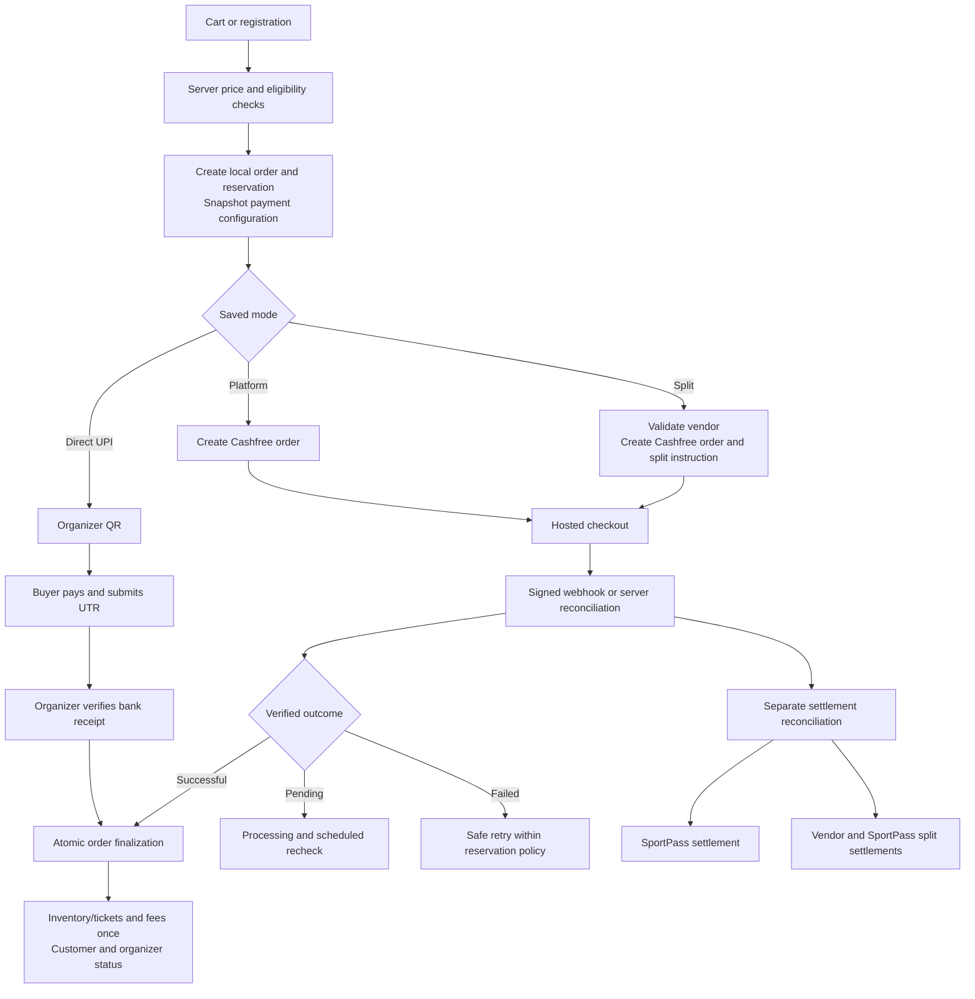

# SportPass payment platform implementation plan

Date: 2026-10-01. Code baseline inspected: `a4a5c2d`, plus working-tree changes present on this date.

Status: implementation specification, not an implemented integration or a completed security audit. No payment system can promise “unhackable”; the acceptance criteria below are intended to prevent identifiable abuse, protect money and support recovery. Cashfree API versions, account entitlements and exact split/refund contracts must be verified in sandbox before production.

## 1. Scope and preserved behaviour

Companion specification: [Cashfree Split vendor onboarding and document handling](cashfree-vendor-onboarding.md). Vendor readiness and secure document handling are prerequisites for split-mode rollout.

Vendor onboarding must be data-first and minimize uploads: reuse existing details, verify supported identifiers/account details, and collect only unresolved evidence required for the actual legal recipient. Support all organizer categories in intake while gating split activation on confirmed provider eligibility; never equate a public club category with a company legal structure or promise zero documents for every vendor.

Support merchandise and event registrations through three admin-configured modes:

| Mode | Collection | Verification | Settlement |
| --- | --- | --- | --- |
| `DIRECT_UPI` | Organizer UPI QR | Buyer submits UTR; authorized organizer verifies bank receipt | Directly to organizer; SportPass does not receive these funds |
| `CASHFREE_PLATFORM` | Cashfree checkout | Verified server-side Cashfree evidence | SportPass merchant settlement account |
| `CASHFREE_SPLIT` | Cashfree checkout | Verified server-side Cashfree evidence | Approved vendor allocation and SportPass allocation through Easy Split |

Modes belong to a store/event and are copied into each order. An organizer cannot select a different payee, vendor, amount, mode or commission through a checkout request. Configuration changes apply only to new orders. No automatic fallback between destinations.

Preserve SPM/SPE display references, full internal UUIDs, ticket/check-in behaviour, Indian mobile validation and conditional delivery fields. Merchandise email remains optional and its automatic emails/retries remain disabled. The existing explicit cancellation-email action is allowed only when an email exists. Event email behaviour must be preserved separately. Cashfree dashboard-controlled customer notifications must be checked too; disabling SportPass mail does not necessarily disable provider notifications.

Platform settlement does not imply all proceeds are SportPass revenue. Track any organizer liability separately. Confirm the proposed collection and onward settlement business model with Cashfree; do not assume standard PG activation authorizes every marketplace flow.

## 2. What today's code actually does

Paths below are relative to the repository root.

| Existing code | Observed behaviour and integration consequence |
| --- | --- |
| `backend/app/api/v1/products.py` | Creates merchandise orders, calculates server prices, decrements variant stock in listing JSON, snapshots totals and reserves paid orders for 30 minutes. Listing queries use row locks. Preserve transaction protection. |
| `place_order`, `authorized_order` in that file | Request-key deduplication and hashed guest access tokens exist. A matching request key currently returns an order after listing/token checks; add a payload fingerprint to reject changed cart/contact requests. |
| `submit_reference` | Changes `awaiting_payment` to `under_review` and clears reservation expiry. A bogus UTR can therefore hold stock indefinitely without a separate review policy. |
| `review` | Approves/rejects/cancels/fulfills; charges Credits on approval; restores stock on rejection/cancellation. Gateway success must not simply call this manual-review endpoint. |
| `delete_order` | Hard-deletes expired/rejected/cancelled merchandise orders. Replace financial deletion with archiving before gateway rollout, preserving keys and payment history. |
| `backend/app/services/payment_service.py` | Generates direct UPI URI/QR. This is not payment verification. Keep as the manual adapter. |
| `frontend/src/pages/ProductStorefront.tsx` | Order and access token are held in React state. A gateway redirect/reload would lose them; secure checkout recovery is a prerequisite. |
| `backend/app/services/registration_service.py` | Existing event registration/batch handling, ticket locks, payment decisions, Credits and email side effects. Extract shared finalization without breaking batch semantics. |
| `backend/app/api/v1/registrations.py` | Confirmation-token flow and ticket downloads. Gateway callbacks must use the same final eligibility rules. |
| `backend/app/services/credit_service.py` | Integer-paise ledger, account balance mutations and source-based deduplication. Reuse accounting discipline, but do not mix monetary settlements with Credits balances. |
| `backend/app/services/refund_service.py` | Manual UPI refund workflow exists; Cashfree path is a placeholder. Merchandise needs its own refund integration as well. |
| `backend/models.py`, `backend/migrations/` | Existing `ProductOrder`, `Payment`, registration/order and Credits models. Add migrations; do not replace live historical IDs or rewrite old payment destinations. |

Before coding, recheck these files against current HEAD. This document is a dated baseline, not permission to overwrite newer work.

## 3. Complete flow

Payment success, fulfillment, refunds, disputes and bank settlement are separate facts. Do not hold a normal paid ticket until a settlement reaches the bank. Conversely, a successful browser redirect is never sufficient to mark it paid.

## 4. Proposed data model and invariants

Add a shared payment aggregate linked to either a merchandise order or event registration order. Prefer explicit foreign keys with a constraint requiring exactly one owner. A batch of registrations shares one aggregate for its total; child allocations remain explicit. Do not charge the full batch total to every child.

Suggested new tables (names provisional):

- `payment_configurations`: organization, store/event scope, provider/mode, merchant-account configuration reference, vendor mapping, fee policy version, enabled state and audit version. Server-owned.
- `organizer_payment_vendors`: local organizer, provider account/environment, vendor ID, readiness/restriction status and bank-detail change audit. Do not store unnecessary KYC documents.
- `payment_orders`: owner, immutable mode, amount/currency, item/fee/refund policy snapshot, provider order ID, expiry, payload fingerprint and accounting allocation.
- `payment_attempts`: provider payment ID, local payment order, attempt status, amount/currency, sanitized failure reason and timestamps. One order may have several attempts.
- `webhook_inbox`: provider/account/environment, deduplication key, payload hash, verified receipt time, processing state and retry metadata. Sensitive raw evidence has restricted access and defined retention.
- `payment_effects` or equivalent unique journal entries: records one-time confirmation, reservation consumption/release, fee posting and ticket issuance.
- `settlement_allocations` and `settlement_entries`: beneficiary mapping version, expected share, actual settlement reference, fees/taxes, adjustments, dates and status.
- `refund_requests` and `refund_attempts`: stable refund ID, original payment, approved amount, allocation, provider reference and observed outcome.
- `outbox_events`: durable post-commit work for provider commands, notifications and reconciliation. Workers must survive process restarts.

Use integer paise internally and exact decimal conversion at the API boundary. Never use binary floating-point arithmetic for financial allocations. Define deterministic rounding and who receives any remaining paise.

Enforce database uniqueness for provider order/payment/refund IDs within account and environment; request idempotency keys within their operation scope; and financial effect keys. Hashes and short SPM/SPE labels are not ownership proof. Full immutable identifiers remain authoritative.

Keep dimensions separate:

| Dimension | Proposed states |
| --- | --- |
| Payment | awaiting, pending, successful, failed-attempt, paid-needs-review |
| Fulfillment | reserved, review-pending, confirmed, fulfilled/checked-in, cancelled, expired |
| Settlement | not-applicable, unallocated, allocated, pending, partial, settled, failed, adjustment-required |
| Refund | none, requested, approved, submitted, pending, partial, refunded, failed |
| Dispute | none, open, evidence-due, resolved, lost |

These are conceptual states: map them to existing registration statuses through serializers during migration rather than immediately changing every consumer.

## 5. Backend boundaries and proposed endpoints

Keep existing checkout routes and introduce payment adapters behind them. Proposed internal modules:

- `services/payments/orchestrator.py`: pricing snapshot, provider-order lifecycle and recovery.
- `services/payments/direct_upi.py`: QR/reference/manual-verification behaviour.
- `services/payments/cashfree.py`: version-pinned API client, bounded timeouts and provider contract mapping.
- `services/payments/finalization.py`: atomic, repeat-safe financial and inventory transitions.
- `services/payments/settlements.py`, `refunds.py`, `reconciliation.py`: separate money movement responsibilities.
- `api/v1/payment_webhooks.py`: dedicated signed provider endpoint.

Suggested application APIs, not Cashfree API names:

| Endpoint | Authorization / contract |
| --- | --- |
| `POST /payments/{local_order_id}/session` | Owner/guest capability plus CSRF for browser session; reuse valid provider order/session; server-owned amount and configuration |
| `GET /payments/{local_order_id}/status` | Owner/guest capability; minimal status response, no vendor banking or secret metadata |
| `POST /payments/{local_order_id}/refresh` | Authorized, rate-limited reconciliation trigger; no browser-controlled status |
| `POST /webhooks/cashfree` | Provider signature authentication; narrowly exempt from browser CSRF, not exempt from validation |
| `POST /organizer/.../refunds` | Authorized tenant, applicable role/approval policy, bounded refund amount |
| `PUT /admin/.../payment-configuration` | Admin authorization, recent MFA for sensitive changes, explicit change reason and audit |

Refactor existing functions that commit or email internally before reusing their business rules. The orchestrator owns the transaction boundary. Network calls and mail must not be executed while holding inventory or accounting row locks.

## 6. Direct UPI lifecycle

1. Validate organizer eligibility, store/event status, prices, stock, phone and delivery data on the server.
2. Create order and reserve inventory atomically. Save a stable request key before the client starts the request; retries reuse it.
3. Display payment QR and clearly state that a UTR submission is required. A QR or UTR is not proof of receipt.
4. An authorized guest submits the reference. Validate format, normalize it and flag reuse across related payees/orders for review. Do not assume a customer-supplied string is globally unique or genuinely bank-issued.
5. Organizer verifies recipient account, amount and actual bank receipt. Record actor, time and evidence/reference. Restrict access to their own organization.
6. Finalize inventory and charge the configured Credits fee once, then confirm. Handle insufficient Credits explicitly; never misrepresent received money as a failed bank payment.
7. Add a bounded review/operations policy for `under_review` orders. Send review reminders to staff or queue overdue reviews. Do not silently expire and resell possibly-paid stock without a reconciliation/refund path.
8. Direct UPI refunds remain organizer-funded with recorded refund reference. Never call Cashfree to refund a payment it did not collect.

Retain existing unpaid-order expiration, but record stock-release effects to prevent double restoration. Rate-limit anonymous order creation and reference submission to reduce inventory hoarding.

## 7. Cashfree order creation and confirmation

1. In a short transaction, validate configuration/vendor readiness, save pricing and reserve inventory. Commit a durable provider-create command with a stable identifier.
2. Call Cashfree outside database locks. Use supported provider idempotency fields with stable values. Map the returned provider order to the local aggregate and expose only the checkout session information needed by the browser.
3. If the request times out, its outcome is unknown. Look up/reconcile the original provider order before attempting another creation. Do not create a second chargeable order automatically.
4. Open hosted checkout. Ensure domain settings and CSP allow the documented SDK/checkout origins. Keep the existing manual UPI branch for orders configured for it.
5. On return, display processing and read authorized backend status. Ignore browser-supplied success flags, amounts, provider IDs and recipient details as evidence.
6. A signature-verified webhook or authenticated provider status lookup supplies evidence. Match merchant account/environment, local mapping, currency, order amount and successful payment attempt. Parse monetary fields exactly. Quarantine mismatches.
7. Finalize once under deterministic locks, with uniqueness constraints as the last line of defense. Publish follow-up work via transactional outbox. A failed email must never roll back successful payment.
8. Reconcile incomplete orders in a worker even when the browser never returns or webhooks are unavailable.

Guest recovery: the present in-memory token is insufficient. Implement a scoped, expiring guest checkout capability, ideally an HttpOnly Secure cookie with a deployment-appropriate SameSite/CSRF design. Retain the current header capability where needed with secure lifecycle handling. Never put bearer tokens in return URLs, analytics or logs. A random public order ID must not grant access to buyer addresses. New-device recovery needs verified ownership (for example phone verification), not knowledge of a phone number alone.

## 8. Webhook security and delivery semantics

- Verify Cashfree's documented signature against the original raw request bytes and timestamp using the configured account secret/official supported verifier. Do not reserialize JSON before verification.
- Pin and test the API/webhook version. Timestamp/replay rules must accommodate documented retries; do not invent an expiry window that rejects legitimate delayed deliveries. Combine authenticity, durable deduplication and financial-state guards.
- Apply body-size limits, schema validation, TLS and safe parsing. An IP allowlist, if maintained, is defense in depth and not a replacement for signature verification.
- Persist a verified event durably before acknowledging acceptance. If processing asynchronously, acknowledge only after the inbox transaction commits. Failed persistence must not return a false success.
- Workers claim inbox items safely, retry transient failures with backoff and move persistent failures to an alertable queue. Manual replay uses the same deduplication and verification rules.
- Distinguish delivery deduplication from business deduplication. Multiple events may describe the same payment; multiple payment attempts may belong to one order.
- Never let a later failed/pending notification downgrade an already verified successful payment. Duplicated success must not duplicate stock, fees, tickets or refunds.
- Unknown provider orders are quarantined and investigated; do not create fulfilled orders directly from webhook content.

## 9. Settlement and fee accounting

For platform mode, record the organizer liability, SportPass fee and actual gateway costs separately. Provider settlement reconciliation marks cash received; it does not create another customer payment. An onward organizer payout is a separate authorized workflow and is not automatically provided by standard PG collection.

For split mode, use a verified vendor mapping captured on the order. Decide between order-time allocation and post-payment allocation only after sandbox/account verification. Persist a stable split command. A timeout means reconcile first, not send another split. If allocation fails after payment, retain paid status and raise an allocation exception; never charge the customer again.

Fee policy must be explicit per order:

- `CREDITS`: charge the existing Credits ledger once; do not withhold that same fee in a split.
- `WITHHOLD_FROM_PROCEEDS`: allocate/retain the SportPass fee once; do not also debit Credits.
- `WAIVED`: record the waiver and authorizing policy.

Recommended initial defaults: direct UPI retains existing Credits rules; Cashfree modes withhold agreed fees from proceeds. This is a proposed business default requiring sign-off, not existing behaviour. Zero Credits must not block a withhold-funded order. If Credits funding is supported for Cashfree, reserve the required Credits before checkout or define a receivable policy; do not collect money and then lose confirmation because Credits disappeared.

Snapshot item total, participant surcharge (if applicable), SportPass fee, discount, currency, expected organizer payable and applicable tax/rounding policy. Gateway fees/taxes and responsibility require separate recorded rules; do not assume they equal SportPass fees. Refunds and adjustments use new ledger entries, never edits to old entries. Split totals must balance against the provider's documented amount basis.

Bank/vendor changes require verified ownership, admin authorization, recent MFA, audit and an explicit handling policy for unsettled historic orders. Never silently redirect historical liabilities to newly supplied bank details.

## 10. Failure and edge-case matrix

| Case | Required behaviour |
| --- | --- |
| Free order | Confirm through existing free-order rules; skip Cashfree and manual UTR; preserve configured fee policy |
| Double-click / HTTP retry | Same request key and fingerprint returns same order; changed payload conflicts |
| Two buyers want last stock | Database lock/atomic update admits only available quantity; test using PostgreSQL, not only SQLite |
| Browser closed / app switch / reload | Payment survives; webhook/reconciliation completes; guest can recover authorized status |
| Cashfree API timeout | Mark operation uncertain and query existing reference; never blindly create another payment/refund/split |
| Failed attempt, later successful retry | One order, several attempts; success finalizes once |
| Two successful payments | Record both receipts; fulfill once; queue surplus-payment refund/review |
| Underpayment / different currency | Quarantine; do not confirm, silently top up or change order total |
| Expired reservation, payment succeeds | Record money received. Reacquire capacity atomically if policy permits; otherwise paid-needs-review with refund path |
| Expiration races success | Same lock order and reservation effect uniqueness; no double release or oversell |
| Cancellation races payment | Preserve receipt; cancelled fulfillment does not imply failed/refunded payment; route refund/review |
| Organizer suspended after checkout | Block new orders; still process payment evidence for old ones; hold fulfillment for review if required |
| Vendor becomes restricted | Block new split sessions; reconcile old allocations; no automatic destination fallback |
| Split/settlement failure | Paid customer order stays paid; finance exception and safe retry/reconciliation |
| Manual approval on gateway order | Reject; only verified provider evidence may establish gateway payment |
| Fraudulent/reused UTR | No automatic approval; flag reuse, apply rate limits and require bank verification |
| Email failure / missing email | Payment succeeds independently; merchandise notifications remain disabled |
| Chargeback/dispute after settlement | Record dispute and financial exposure; no deletion; preserve evidence and track response deadline |
| Provider outage | Keep pending/uncertain state and show accurate customer messaging; do not claim payment failed without evidence |
| Worker/database outage | Durable retry/recovery; no acknowledgement before persistence |
| Store closed after purchase | Existing order status/recovery remains available; closure blocks new sales |
| Refund after check-in/fulfillment | Policy/authorized review decides eligibility; never automatically restore consumed inventory |
| Batch event purchase | One payment total; explicit per-registration allocation; no partial duplicate confirmation or charge |

## 11. Refunds, cancellation and financial retention

Implement refunds for merchandise and events. Keep policy approval separate from execution and settlement. Validate refundability against verified received funds minus completed and in-flight refund reservations. Lock when reserving refundable amounts so two concurrent refunds cannot exceed the payment.

Use stable refund IDs and record uncertain outcomes. Accepted/submitted is not refunded. Handle partial refunds, failed refunds, retry and reconciliation. Allocate item/platform fee/gateway charge adjustments according to the saved policy and provider contract. For Easy Split, verify pre-settlement and post-settlement refund behaviour and insufficient vendor balance; never assume funds can always be clawed back instantly.

Cancellation prevents fulfillment when appropriate; it does not certify money has returned. Restore stock only under the documented fulfillment policy, once. Invalidate/refuse refunded event tickets consistently with partial/batch refund policy and check-in state.

Archive financial orders instead of hard deletion. Retain idempotency tombstones and payment mappings so delayed callbacks remain reconcilable. Restrict retained PII, define deletion/anonymization and backup retention separately from financial evidence retention.

## 12. Security acceptance criteria

1. Prices, stock, discounts, fees, destinations and payment modes are derived and validated server-side. Reject unexpected money-related client fields.
2. Every organizer action checks tenant ownership on the server. A UUID is not authorization. Test cross-organizer reads, approval, export, refund and configuration writes.
3. Browser mutations retain CSRF protections; narrowly isolate provider-authenticated webhook routes. Restrict credentialed CORS origins.
4. Store Cashfree secrets only in server secret configuration; separate sandbox/production credentials and webhook handling. Rotate with a documented recovery procedure. Never expose secrets in frontend bundles, errors or logs.
5. Refunds, bank changes and settlement configuration require appropriate privileges and MFA/approval thresholds. Ordinary organizers cannot raise their split percentage or change platform-owned mappings.
6. Bound checkout, token checks, status refreshes, UTR submission and refund requests with rate limits. Add adaptive abuse controls for inventory hoarding without making normal guests unusable.
7. Payment sessions/tokens are sensitive; minimize exposure, expire them, avoid URLs and telemetry. Protect the checkout from XSS with escaped content and reviewed CSP.
8. Use fixed provider API hosts and allowlisted return URLs. Never fetch arbitrary client-supplied callback URLs or accept an open redirect. Do not handle raw card/PIN credentials in SportPass.
9. Use database constraints, deterministic row-lock order, transaction rollback and concurrency tests. Avoid using process-local locks as the sole protection across workers.
10. Maintain actor/operation audit records and redact phone, addresses, bank identifiers, access tokens and secrets from general logs. Restrict support access to financial evidence.
11. CSV exports must continue neutralizing spreadsheet formulas in user-controlled fields.
12. Provider status refresh and webhook paths must enforce identical finalization invariants. A support “force paid” bypass must not be introduced.

## 13. Migration and delivery sequence

1. **Contract and policy review:** confirm PG/Easy Split enablement; API version, vendor lifecycle, amount units, webhook signatures/events/retries, session expiry, refunds, split timing and settlement deductions. Agree fee funding and late-payment/refund policies.
2. **Shared foundations:** additive schema, archive financial orders, durable operation/inbox/outbox records, guest recovery, finalization extraction and direct-UPI regression coverage.
3. **Cashfree platform sandbox:** merchandise checkout, signed events, reconciliation, expiration races, dashboards and refunds. Do not enable public production traffic yet.
4. **Easy Split sandbox:** vendor readiness, split allocations, restrictions, settlement reporting and refund adjustments. Reconcile totals with provider reports.
5. **Events:** apply the shared service to single/batch registration, ticket generation, refund eligibility, claims and check-in; preserve current event notification policy.
6. **Controlled rollout:** independent feature flags per mode and store/event, one approved merchant/vendor cohort first, monitored payment and settlement reconciliation.
7. **Production operation:** scheduled pending-order reconciliation, refund/split retry queues, settlement matching and alerts with runbooks.

Backfill existing orders as direct UPI based on their actual historical provider, not today's store configuration. Leave existing QR/UTR flows functional. Make new columns nullable or compatible initially, backfill, validate, then apply stricter constraints. Rehearse migrations/restores on an isolated database copy; no production data mutation is part of this documentation task.

Rollback disables creation of new Cashfree sessions but continues processing existing webhooks, refunds and reconciliation. Never roll back by dropping payment tables or converting already-created gateway orders to direct UPI.

## 14. Required verification before launch

Extend existing tests including `backend/tests/test_product_sales_e2e.py`, `test_registration_decisions.py`, `test_credit_service.py`, `test_manual_refund_authorization.py`, and `frontend/src/test/ProductStorefront.test.tsx`.

- Unit tests: exact money conversion, rounding, fee allocation, transition guards, fingerprint conflicts, optional merchandise email and conditional address validation.
- Integration tests: all three modes for merchandise and event batches; unsigned/altered/wrong-account webhook rejection; duplicates, delayed/out-of-order events; provider timeout recovery; ownership checks.
- PostgreSQL concurrency tests: last stock, repeated confirmation, refund limits, Credits debit, expiry versus success, cancellation versus success and duplicate successful attempts.
- Browser tests: mobile app switching, refresh/back/return, delayed notification, retry, missing email, clear pending status and no exposure of another buyer's order.
- Accounting tests: withhold versus Credits, zero Credits, partial refunds, vendor changes, split failure, fees/taxes and settlement discrepancies.
- Operational tests: worker restart, inbox replay, failed persistence, credential rotation, rollback with live pending payments and backup recovery.
- Sandbox contract fixtures: record the pinned version and sanitized real response/webhook shapes. Treat unknown enum values as reviewable rather than success.

Release gates: no unmatched successful sandbox payments; each success finalizes once; refunds never exceed receipts; payouts/splits balance; private data cannot cross tenants; pending payments recover without a browser; no new type/build/test failures attributable to the change. Any existing repository failures must be recorded explicitly rather than reported as a clean run.

## 15. Observability and runbooks

Correlate local order, provider order, payment attempt, webhook, refund and settlement IDs. Monitor stuck sessions, webhook verification failures, processing lag, unmatched receipts, duplicate receipts, negative inventory, fee discrepancies, late success, failed refunds and unsettled allocations. Alert on actionable thresholds without logging secrets.

Provide runbooks for “customer debited, order pending”, “stock expired before success”, “vendor settlement failed”, “duplicate charge”, “refund pending”, “webhook outage”, “credential compromise” and “organizer bank change”. Reconcile with authenticated provider evidence; never ask support to trust a screenshot alone.

## 16. Current official references and unresolved provider contracts

References checked 2026-10-01. They establish the broad capabilities, not a completed verification of every current endpoint:

- [Cashfree hosted web checkout](https://www.cashfree.com/devstudio/preview/pg/web/checkout): server-created order and checkout session integration.
- [Cashfree webhook verification](https://www.cashfree.com/devstudio/preview/pg/tools/webhookVerification): verify signatures before accepting provider events.
- [Cashfree Easy Split API overview](https://www.cashfree.com/docs/api-reference/payments/latest/split/easy-split-overview): vendor, split, refund and settlement API families.

Before implementing the provider adapter, attach a versioned contract checklist with exact endpoints, required/optional fields, idempotency support, error codes, webhook schemas, retry policy, phone/email acceptance and split-refund semantics tested for the SportPass account. Do not invent vendor approval statuses, assume settlement schedules, or claim Cashfree eliminates every Google Pay/bank decline.
